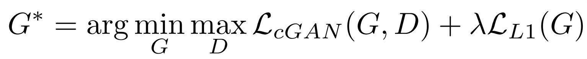

# ChromaGen
## Introduction
The task of colorizing black and white images has long been a challenging endeavor, traditionally requiring substantial human effort and hardcoding. With recent advancements in artificial intelligence and deep learning, this process can now be automated end-to-end.

## Background
### Color Spaces
- RGB Color Space: Images are represented as a rank-3 array (height, width, color) with three numbers for each pixel, indicating the intensity of Red, Green, and Blue channels.
  
  
- Lab Color Space: Comprises three channels - L (Lightness), a (green-red), and b (yellow-blue). The L channel appears as a grayscale image, which is why it is commonly used in colorization tasks. By using Lab, we can give the L channel to the model (grayscale image) and predict the *a and *b channels to reconstruct the colorful image.

  
## Why Lab Over RGB ?
- Prediction Simplicity: Predicting two channels (*a and *b) is simpler than predicting three (RGB).
- Combination Reduction: With 256 choices per channel, RGB has 256³ combinations (over 16 million) while Lab has 256² (about 65000).
## Strategy
Image-to-Image Translation with Conditional Adversarial Networks (pix2pix)
Pix2pix proposes a general solution using:

- Generator: Takes a grayscale image (L channel) and produces a 2-channel image (*a and *b).
- Discriminator: Takes the generated *a and *b channels, concatenates them with the grayscale image, and decides if the image is real or fake.
## Loss Functions
- Adversarial Loss: Encourages realistic-looking colorizations.
- L1 Loss: Reduces conservative colorizations (e.g., gray or brown) by penalizing the mean absolute error between predicted and actual colors.
- Combined Loss: Balances the contributions of both losses using a coefficient λ.

  
## Model Architecture
### Generator (U-Net)
The U-Net architecture consists of:

- Down-sampling: Reduces the input image size step-by-step to extract features.
- Up-sampling: Expands the reduced image back to the original size, producing the color channels.

  
### Discriminator
The discriminator is a "Patch" discriminator, which:

- Outputs: A decision for each patch (e.g., 70x70 pixels) of the image rather than the whole image.
- Structure: Stacks Conv-BatchNorm-LeakyReLU blocks to make the decision.
## Training
### Initial Training
#### Train Discriminator:
- Feed generated (fake) images and label as fake.
- Feed real images and label as real.
#### Train Generator:
- Use discriminator's feedback to produce realistic images.
- Combine adversarial loss and L1 loss for supervision.
### New Strategy - Final Model
#### Pretraining:
- Stage 1: Use a pretrained ResNet18 as the backbone of the U-Net.
- Stage 2: Train the U-Net with L1 loss on the colorization task.
#### Final Training: 
- Combine adversarial loss with L1 loss as before.
## Conclusion
This project demonstrates how to effectively use deep learning for image colorization with limited data and training time. By leveraging pretrained models and a two-stage training process, significant improvements in efficiency and results can be achieved.

For detailed code and further explanations, refer to the included scripts and comments.

Stay tuned for more updates and feel free to contribute!
## References
- Pix2Pix Paper : [Image-to-Image Translation with Conditional Adversarial Networks](https://arxiv.org/abs/1611.07004)
- Lab Color Space: [Understanding Lab Color Space](https://en.wikipedia.org/wiki/CIELAB_color_space)
- COCO Dataset: [COCO - Common Objects in Context](https://cocodataset.org/#home)
